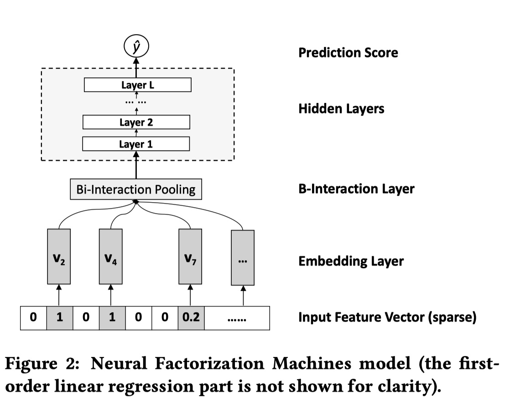

Factorization Machines 由日本 Osaka University 的 Steffen Rendle [1] 在 2010 年提出。FM 是一种常用的因子机模型

## FM 

### 电影评分

【数据图】

$$\hat y:= w_0 + \sum_{i=1}^{n} w_ix_i + \sum_{i=1}^n \sum_{j=i+1}^n \left \langle v_i,v_j \right \rangle x_iy_i$$

$$W_{i,j}=\left \langle v_i,v_j \right \rangle = \sum_{f=1}^kv_{i,f} \cdot v_{j,f}$$

$$\sum_{i=1}^n \sum_{j=i+1}^n \left \langle v_i,v_j \right \rangle x_iy_i = \frac{1}{2}\sum^k_{f=1} \left( \left(\sum_{i=1}^nv_{i,f}x_i \right)^2 - \sum^n_{i=1} v^2_{i,f} x_i^2 \right)$$

$$\frac{\partial}{\partial \theta} \hat y \left( x \right) =
\begin{cases}
1, & \text{ if $\theta$ is $w_0$} \\
x_i, & \text{ if $\theta$ is ${w_i}$} \\
x_i\sum^n_{j=1} v_{j,f}x_j - v_{i,f}x_i^2, &\text{if $\theta$ is ${v_{i,f}}$}  
\end{cases}
$$
$$

### FM vs SVM

对于经典的特征组合问题，不难想到使用 SVM 求解。Steffen 在论文中也多次将 FM 和 SVM 做对比。

一个二阶

最后总结一下，FM 相比于 SVM 有下面三个特点：
    1. SVM 中虽然也有特征交叉项，但是只能在样本中含有相对应的特征交叉数据时才能学习。但是 FM 能在数据稀疏的时候学习到交叉项的参数。
    2. SVM 问题无法直接，常用的方法是根据拉格朗日对偶性将原始问题转化为对偶问题。
    3. 在使用模型预测时，SVM 依赖部分训练数据（支持向量），FM 模型则没有这种依赖。

## NFM

在工业界，实际上大部分需要处理的问题都是非线性，前文介绍的 FM 模型很难学习特征之间的高阶隐藏关系。Neural Factorization Machines 正是在这样的背景下诞生的，它的结构如下：
$$
\hat { y } _ { N F M } ( \mathbf { x } ) = w _ { 0 } + \sum _ { i = 1 } ^ { n } w _ { i } x _ { i } + f ( \mathbf { x } )
$$

其中第一项和第二项是线性回归，第三项是神经网络。神经网络中利用 FM 模型的二阶特征交叉结果做为输入，学习数据之间的高阶特征。与直接利用高阶 FM 模型相比，可以降低模型的训练复杂度，加快训练速度。

模型的神经网络部分包含 4 层，分别是 Embedding Layer、Bi-Interaction Layer、Hidden Layers、Prediction Score。

1. Embedding Layer 层对输入的稀疏数据进行 Embedding 操作。一般来说最常见的 Embedding 是在一张权值表中进行 lookup 操作，论文中作者强调他们这一步操作需要处理带权重的向量。
2. Bi-Interaction Layer 层是这篇论文的创新，这一层将 Embedding vector 转换成为只有 k 维的单独向量。
3. Hidden Layers 层是一个常规的 DNN

##  Reference

1. Rendle, Steffen. “Factorization Machines,” 995–1000, IEEE, 2010. doi:10.1109/icdm.2010.127.
2. 
3. [深入浅出Factorization Machines系列](http://kubicode.me/2018/02/23/Deep%20Learning/Deep-in-out-Factorization-Machines-Series/)
4. [因子机深入解析](https://tracholar.github.io/machine-learning/2017/03/10/factorization-machine.html)
