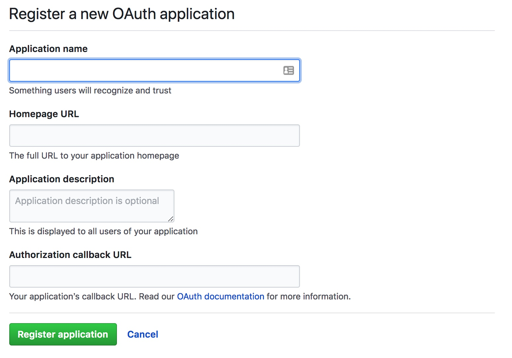
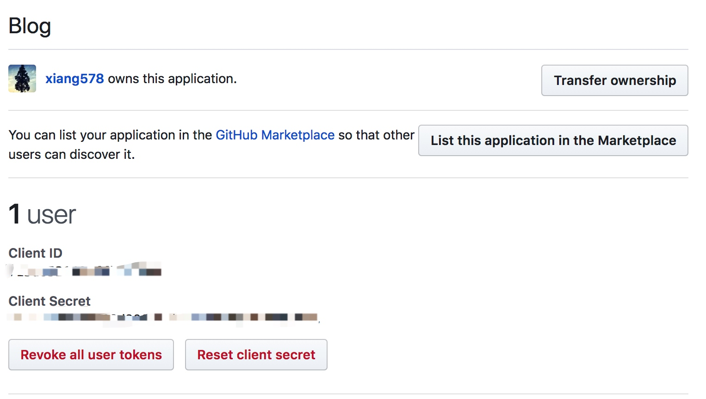
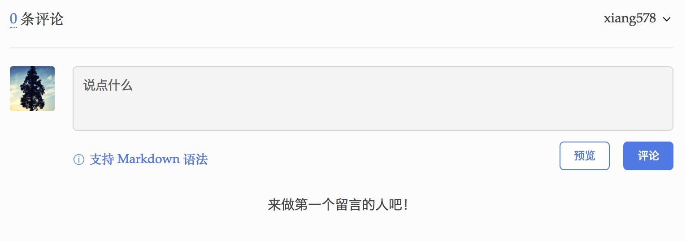
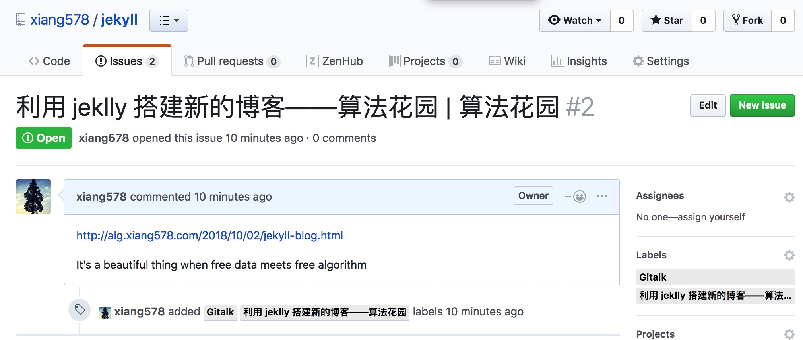

{:toc}

## 起

最近几个月，刚刚告别校园。在工作中遇到一些挑战，需要自己去学习一大堆的知识，所以准备在博客上记录一下。不过之前的 hexo 博客原生不支持数学公式，按网上的方法加插件也没有成功。所以直接利用 jekyll 搭建一个新的博客。

新博客取名为“算法花园”，看起来颇有几分自大。并且从目前的文章数量来看，最多称得上是“算法荒地”，也不知道自己有多少的时间来给这一片荒地开荒。希望你下次再过来时，这里除了野草还有几朵野花。

## 搭建

貌似

## Gitalk

主题中自带 disqus 评论框架，不过为了博客的可持续发展，还是决定使用基于 Github Issues 作为评论数据的载体。目前有两种方案，Gitalk 和 gitment。这两种我都尝试了一下，不过 gitment 目前在页面登录时会出现错误，所以直接选用 Gitalk。这个框架的引入也十分的简单，下面简单介绍一下。

### 申请 github OAuth

登录 Github 后，选择 `Settings - Developer settings - OAuth Apps` ，点击 `New OAuth App`，填写下面这样的表单。除了 `Authorization callback URL` 需要填写你的博客地址，其他都可以随意填写。



点击 `Register application` 后，会生成下图所示的配置文件。其中 `Client ID` 和 `Client Secret` 会在下一步中使用。



### 修改 jeklly 

直接修改文章页面的样式，我使用的主题 post 样式保存在 `_layouts/post.html`。

在这个文件中添加 Gitalk 使用 的 css 和 js 文件：

```html
<link rel="stylesheet" href="https://cdn.jsdelivr.net/npm/gitalk@1/dist/gitalk.css">
<script src="https://cdn.jsdelivr.net/npm/gitalk@1/dist/gitalk.min.js"></script>
```

添加 Gitalk 的评论框：

```
<div id='gitalk-container'></div>
<script>
const gitalk = new Gitalk({
  clientID: 'clientID',
  clientSecret: 'clientSecret',
  repo: 'repo',
  owner: 'owner',
  admin: ['admin'],
  id: '{{}}',
  distractionFreeMode: false  // Facebook-like distraction free mode
})

gitalk.render('gitalk-container')
</script>
```

其中 clientID 和 clientSecret 由上一步申请 OAuth Apps 时生成，直接复制过来使用。repo 指定将评论相关的 Issues 创建在哪个仓库，一般选择你保存 jeklly 文件的仓库。owner 指定 repo 的主人，一般就是你自己的 Github 用户名。admin 可以初始化文章评论的用户。id 指定是某篇文章的评论在 Issues 中的标题，使用 `page.title` 可以将文章的标题当成是 Issues 的标题。（注：上面的代码中 id 对应的值为 `'{{}}'`，你在复制的时候需要在 `{{}}` 中间添加 `page.title` ，我这样处理是因为将替换后的结果写在文章中，会被 jekyll 渲染成这篇文章的标题而无法正确显示。）

完成以上这两步，每篇文章下方都会生成一个评论框。



对应的 Github repo 的 Issues 中也会有一个 [issue](https://github.com/xiang578/jekyll/issues/2)。




