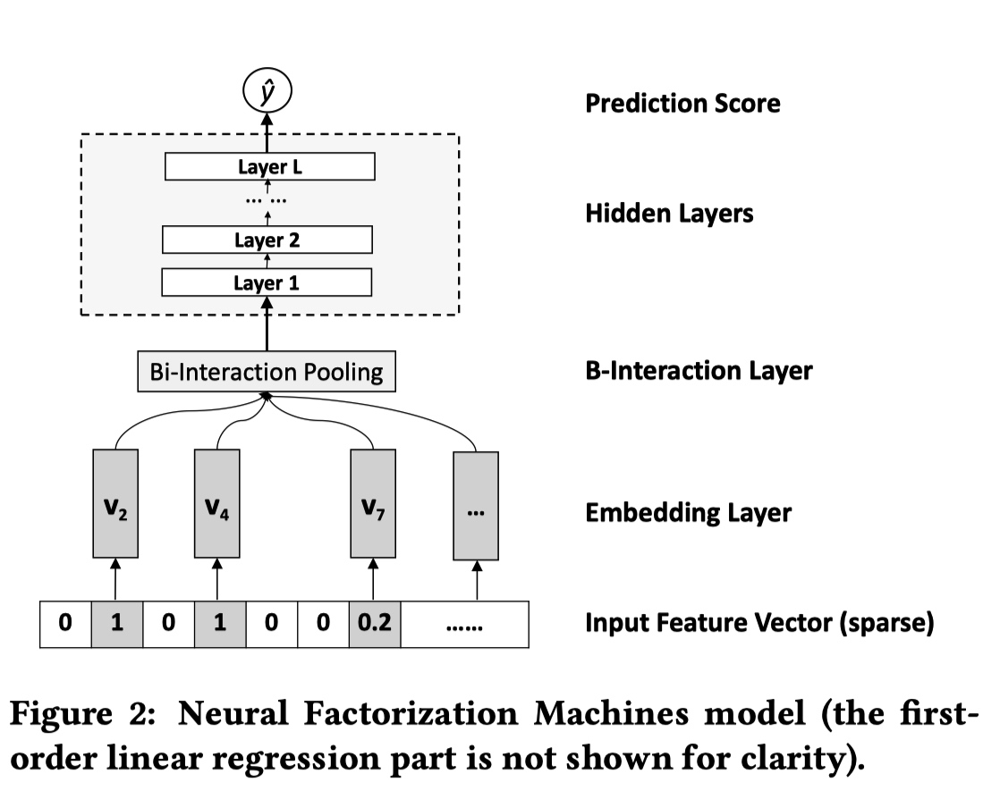


前几周介绍了 [FM 模型](http://alg.xiang578.com/2018/10/02/Factorization-Machines.html)，它通过线性模型中的不同因子之间的交叉特征增强线性模型的表达能力。在很多机器学习的实际应用中，需要处理的大部分数据是非线性的。NFM 正是在这样的背景下诞生的一种模型，它利用 FM 对二阶特征进行线性交叉，同时通过模型中神经网络部分学习高阶非线性特征。通过这种方法，既增强了线性模型的表达能力，也降低了模型的训练复杂度。

## 模型结构

NFM 结构如下：其中第一项和第二项是线性回归部分，第三项是神经网络部分。

$$
\hat { y } _ { N F M } ( \mathbf { x } ) = w _ { 0 } + \sum _ { i = 1 } ^ { n } w _ { i } x _ { i } + f ( \mathbf { x } )
$$

下面重点介绍一下神经网络的结构：

